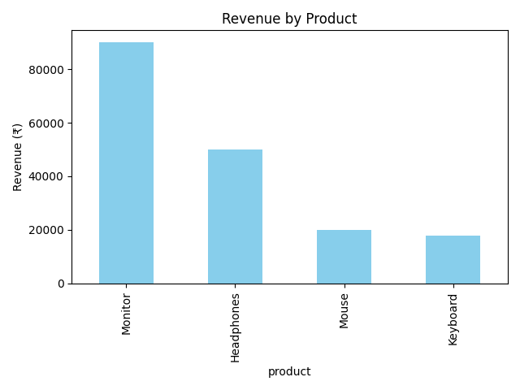

# SQLite-Database-using-Python_Task7
Python + SQLite project to create a small sales database, run SQL queries, and visualize revenue by product using Pandas and Matplotlib.
# Task 7 - Basic Sales Summary with SQLite & Python

##  Overview
This project is part of my Data Analyst Internship tasks.  
It demonstrates how to use **Python** with **SQLite** to:
- Create a small sales database
- Run SQL queries to summarize data
- Load results into Pandas
- Visualize the results with Matplotlib

The notebook generates a sales summary showing **total quantity** and **total revenue** per product, along with a bar chart.

---

## Files in Repository
- **Task7_Sales_Summary.ipynb** → Jupyter Notebook containing the full code
- **sales_data.db** → SQLite database file with sample data
- **sales_chart.png** → Revenue-by-product bar chart
- **README.md** → Project documentation

---

## Tools & Libraries Used
- **Python**
- **SQLite (sqlite3 module)**
- **Pandas** (data analysis)
- **Matplotlib** (data visualization)
- **Jupyter Notebook**

---

## Steps Performed
1. Created `sales_data.db` with a `sales` table (product, quantity, price)
2. Inserted sample sales data
3. Ran SQL queries to:
   - Calculate total quantity sold per product
   - Calculate total revenue per product
4. Loaded SQL results into Pandas DataFrame
5. Printed summary tables
6. Created and saved a bar chart (`sales_chart.png`)

---

## Sample Output
**Per-product summary:**
| product    | total_qty | revenue |
|------------|-----------|---------|
| Monitor    | 6         | 90000   |
| Headphones | 20        | 50000   |
| Mouse      | 25        | 20000   |
| Keyboard   | 15        | 18000   |

---

## Chart
The chart below shows the revenue per product:



---

## How to Run
1. Clone the repository:
   ```bash
   git clone <your-repo-link>
